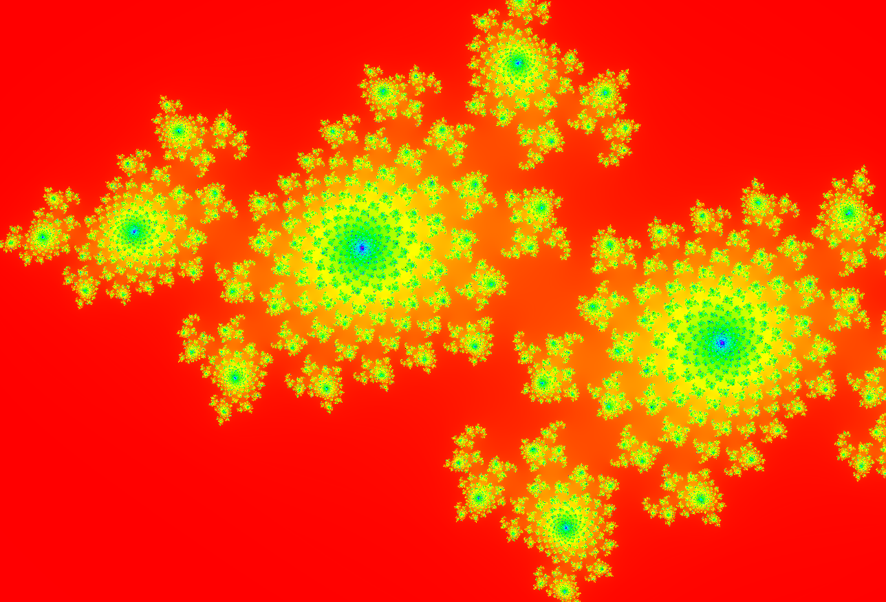
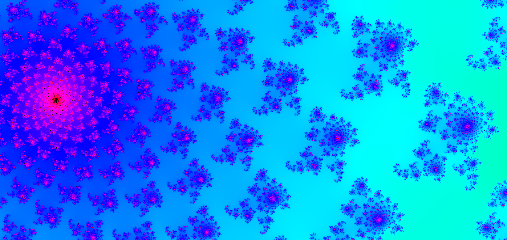

# CUDA-accelerated fractal renderer

Renders fractals such as the Mandelbrot and Julia sets in an interactive window using CUDA for GPU acceleration.


> [!WARNING]
> CPU rendering is not supported yet. A compatible NVIDIA GPU is required.

[Supported GPUs](https://developer.nvidia.com/cuda/gpus)

## Examples

### Mandelbrot Set


### Julia Set





### Burning Ship Fractal

(This one definitely needs more work)


## Usage

```bash
./run.sh

Options:
  -i, --iterations <iterations>     (Default 500)
  -f, --fractal <fractal>           (Default mandelbrot)
  -t, --theme <theme>               (Default default)

Fractal types: 
    mandelbrot
    julia
    burning_ship
    
Themes:
    default
    blue_gold
    rainbow
    neon

Example:

./run.sh -f julia -i 1000
```
